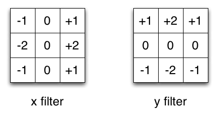

# Edge-Detection-using-Sobel-Filter
This is a project completed by me for Computer Vision and Image Processing course during my MS at University at Buffalo
 
The main goal of this project is to develop a strong understanding regarding the various concepts of processing the image such as Edge Detection, Key Point Detection and then using these concepts accomplish tasks such as Cursor Detection. It also aims at allowing the student to develop a strong understanding regarding how the basic operations like Convolution work at a unit level.

## What is Edge Detection?
Edge Detection can be described as an Image Processing technique used to detect fine boundaries in an image. This technique is required to distinguish different objects in an image. Key Point detection performs its operation by applying some kind of an image filter that allows the edges in the image to be extracted.
In this project we have used Sobel Filter for Edge Detection. It has following filter coordinates for X and Y axis 

### Input image:

### Output images:

 
**Edges along X direction**

 
**Edges along Y direction**

